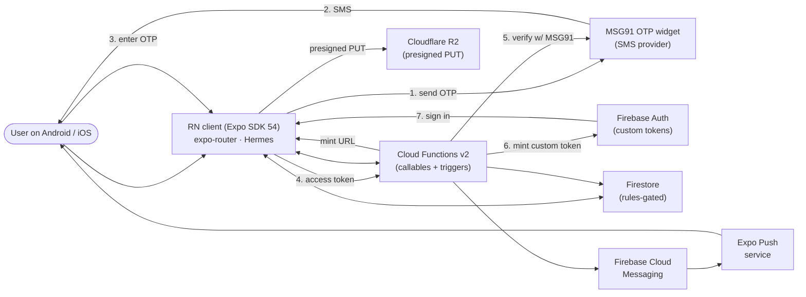
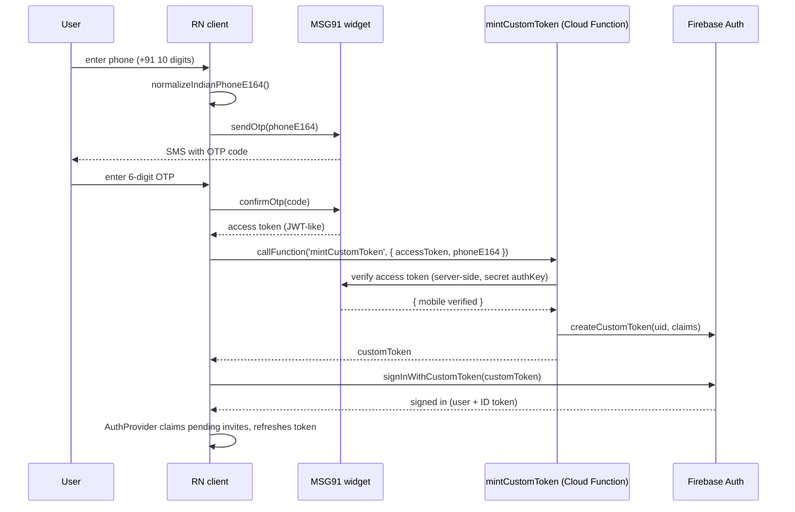
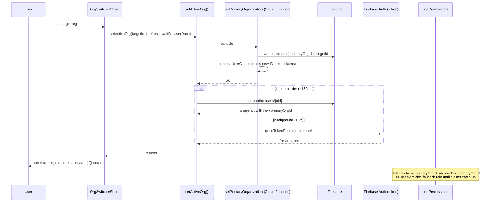
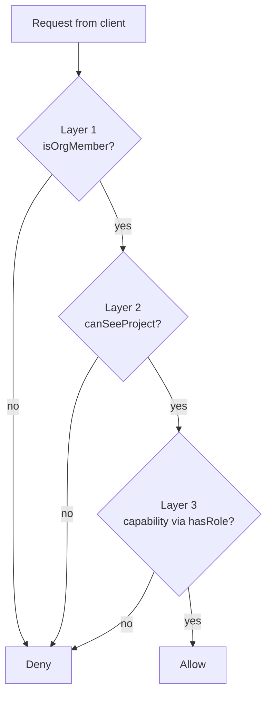
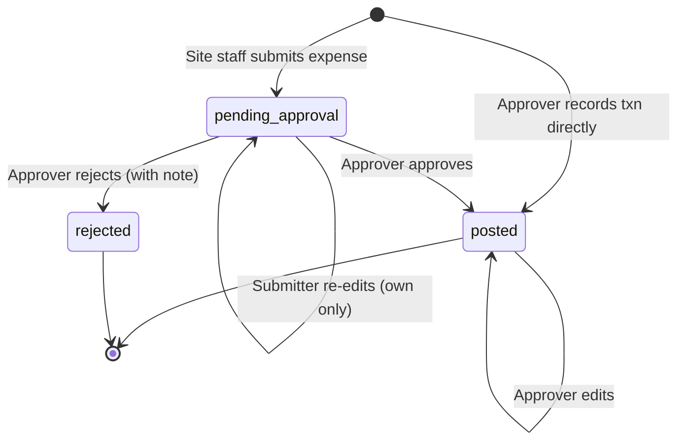
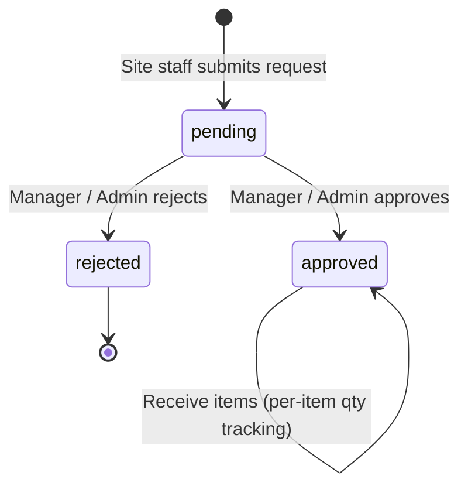
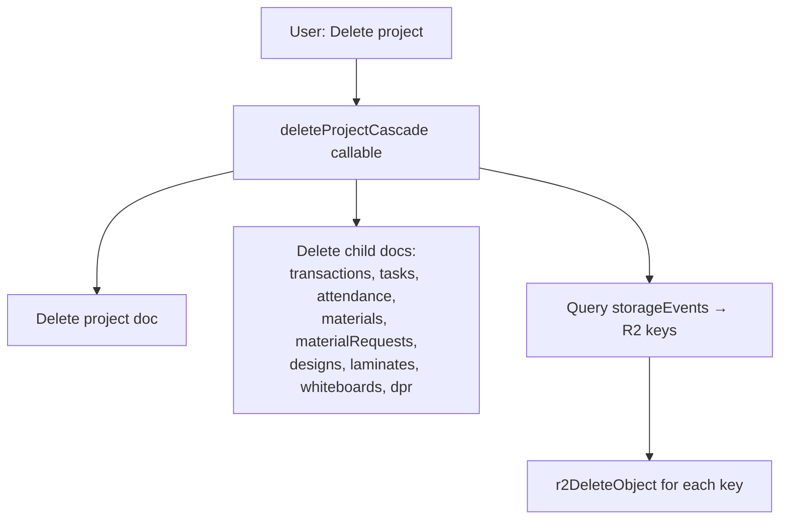
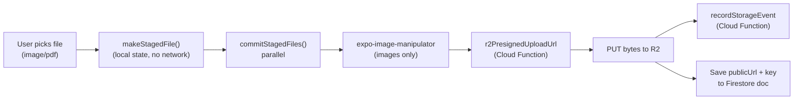

# SiteExpens — Product & Architecture Document

> A single document that describes what SiteExpens is, who uses it, what
> every role can and cannot do, how data flows through the system, and
> how all the moving parts (client app, Firebase, R2, MSG91, push) fit
> together.
>
> Top half is plain-English and table-driven so anyone can follow.
> Bottom half adds technical depth for engineers joining the project.
> Every claim cross-references a file path so the doc stays
> diff-checkable as code evolves.

---

## Table of contents

**Part 1 — Product**
1. Product summary
2. User personas
3. Day in the life — per role

**Part 2 — Architecture & foundations**
4. System architecture
5. Tech stack
6. Authentication flow
7. Organisation model
8. Org switch flow

**Part 3 — Authorisation model**
9. Role × capability matrix and visibility maps
10. Three-layer security model
11. Privilege-locked fields
12. Project membership management

**Part 4 — Features (UI surface)**
13. Bottom-tab features
14. Project-detail features

**Part 5 — Workflows**
15. Transaction submit → approve → reject (deep dive)
16. Material request workflow
17. Task assignment & progress
18. DPR (Daily Progress Report)
19. Project deletion cascade

**Part 6 — Cross-cutting concerns**
20. Files & R2 storage pipeline
21. Push notifications
22. Realtime data + auto-recovery
23. Stale-claim auto-heal
24. Phone number normalisation
25. memberPublic projection sync
26. Backfill callables

**Part 7 — Reference catalogues**
27. Firestore data model
28. Cloud Functions catalogue
29. Client hook catalogue
30. UI primitives + design tokens

**Part 8 — Operational notes**
31. Build & deploy
32. Known limitations + edge cases

---

# Part 1 — Product

## 1. Product summary

**SiteExpens** is an iOS + Android app for **interior-fitout and
construction studios in India** to run projects end-to-end on a single
surface — covering site execution (attendance, daily progress, material
requests, tasks), project finance (income, expenses, party ledgers),
files (designs, laminates, whiteboards), and team coordination
(invites, roles, multi-org membership, client visibility).

The typical engagement: a studio owner runs the office, an accountant
keeps the books, a manager runs project handovers, and a supervisor +
site engineer execute on site every day. The studio's clients are
invited per-project to see only their own progress. SiteExpens replaces
WhatsApp threads, Excel sheets, scattered photos, and paper bills with
one role-aware app.

The product is **phone-only auth (+91 India only)**, **multi-org**
(one user can be in many studios with different roles in each), and
**role-restricted from rules-up** so the wrong-role user can't even
see a screen they shouldn't act on.

---

## 2. User personas

| Role | Who they are in real life | Primary daily activity | Should NOT be able to |
|---|---|---|---|
| **Super Admin** | Studio owner / founder | Approve big-ticket expenses, oversee studio | (Nothing — they own the studio) |
| **Admin** | Trusted second-in-command | Same as Super Admin minus ownership transfer | Transfer ownership (planned future flow) |
| **Manager** | Project manager / studio coordinator | Plan projects, assign teams, manage materials, run CRM | Touch studio finance / banking |
| **Accountant** | Bookkeeper / finance clerk | Record income, post payments, manage parties, run reports | Edit project structure or tasks |
| **Site Engineer** | Tech lead on site | Update tasks, record materials, submit purchase bills, mark attendance | See other people's submissions, record income, edit posted txns |
| **Supervisor** | Junior on-site lead | Daily attendance, DPR, material requests, submit purchase bills | Create tasks, see other people's expenses, record income |
| **Viewer** | Auditor / partner / silent stakeholder | Read everything across the studio | Write or modify anything |
| **Client** | Customer of the studio | View progress + designs on a single project | See finance, tasks of other clients, anything outside their project |

The 8 roles are defined as `RoleKey` in
`src/features/org/types.ts` and labeled in
`src/features/org/permissions.ts:10-19` (`ROLE_LABELS`).

---

## 3. Day in the life — per role

### Super Admin / Admin (studio owner / right hand)

Opens the app to **Projects**. Scans the project list — sees full
income / expense / balance for every project, plus due-date alerts.
Drops into one project to check yesterday's expenses (Transactions
tab), approves any pending bills submitted by site staff. Moves to
**Overview** — sees studio-wide finance totals, lead pipeline KPIs,
material approval queue. Hops to **CRM** to convert a hot lead to a
project. Uses **Toolkit** for any inline calculation. Has every "+"
button, every edit pencil, every approve/reject control. The only
role that can be the org's `ownerId` is Super Admin, and the only
role that can transfer it is (planned) admin or owner themselves.

### Manager

Opens to **Projects**. Sees the projects they're a member of (admins
see all; managers must be added explicitly). Adds a new project with
budget and dates. Goes into a project, assigns tasks to the site team
on the **Tasks** tab, approves the supervisor's material request on
the **Material** tab. Picks up **CRM** to log a site visit appointment.
Sees transaction totals (read-only) but cannot post a new income or
delete an expense. Cannot edit studio-level settings.

### Accountant

Opens to **Projects** but their daily home is **Overview** for
studio-wide finance plus a project's **Transactions** + **Party** tabs.
Adds payment-in (a client paid an invoice), posts payment-out (settled
a vendor bill). Approves expenses submitted by site staff. Manages
**Parties** (vendors, clients, contractors) with bank details and
opening balances. Sees no Tasks, no DPR, no Attendance — those tabs
don't appear inside the project for them. Has the **Studio Finance**
sub-feature for org-level (non-project) expenses.

### Site Engineer

On site, opens to **Projects** → a single project. Lives on the
**Site** tab (today's attendance + today's task updates + today's
material movements). Marks attendance, updates task progress on
their assigned tasks (`task.update.own`), uploads photos to the
**Files** tab. Raises a material request when stock runs low. Files
purchase bills via the **Submit Expense** button (Payment In is
hidden — they cannot record income; system blocks it client-side
AND server-side). Their submitted bill appears in their own list
with a "Pending approval" badge; they cannot see other engineers'
or supervisors' bills. Once an admin approves, the bill counts in
project totals.

### Supervisor

Junior on-site role. Same daily flow as Site Engineer but lighter:
no Tasks tab (cannot create tasks; can only update progress on
tasks assigned to them), no Files / Designs / Laminates / Whiteboard
(visual design is not their job), no Overview tab (no studio-wide
view at all). Their core surface is **Site / Attendance / Material /
Submit Expense / Party**. Restricted to `payment_out` only, own
submissions only.

### Viewer

Opens to **Projects** — sees everything. Drops into any project and
all 9 project tabs load. Sees CRM. Sees Overview with full finance
totals. Tries to tap any "+" / pencil / Approve button and finds it
disabled or absent. The role exists for auditors, silent partners,
or studio investors who need full visibility but no write power.

### Client

Opens to **Projects** — sees only the project(s) the studio explicitly
added them to (via `clientUids`, not `memberIds`). Inside the project,
they get only 4 tabs: **Site** (read-only daily progress), **Tasks**
(read-only milestone view), **Files** (designs + drawings the studio
chose to share), **Laminate** (selections for their fitout). They
never see expenses, vendor parties, attendance, the full team.
They have zero capabilities (`new Set<Capability>()`); the UI hides
every action button.

---

# Part 2 — Architecture & Foundations

## 4. System architecture



**Plain English**: the user signs in with their phone via MSG91 OTP.
A Cloud Function verifies the OTP and gives them a Firebase login
token. From then on, the app reads/writes Firestore directly (gated
by security rules). For privileged operations (invites, role changes,
org switches), the app calls Cloud Function callables which use the
admin SDK to bypass rules. Files (receipts, designs) go straight to
Cloudflare R2 via presigned URLs minted by a function. Push
notifications fan out via FCM → Expo's push relay → device.

## 5. Tech stack

**Runtime**
- React Native 0.81 + Expo SDK 54 (new architecture, Hermes engine)
- TypeScript everywhere; `npx tsc --noEmit` for type safety

**Routing & UI**
- `expo-router` — file-system routing under `app/`
- `react-hook-form` + `zod` for forms
- `react-native-svg` for SVG (whiteboard thumbnails)
- `@expo/vector-icons` (Ionicons) for the icon set

**State**
- Plain React hooks for data; no redux / zustand
- Each feature owns a `useXxx.ts` hook that subscribes to Firestore

**Backend SDK**
- Firebase JS SDK (modular) wrapped in a chained-API facade
  (`src/lib/firebase.ts`) — exposes `auth`, `db`, `firestore`,
  `callFunction<In, Out>(name, payload)`. Not `@react-native-firebase`
- AsyncStorage persistence for the auth session

**Storage / files**
- Cloudflare R2 via presigned PUT URLs (Cloud Function `r2PresignedUploadUrl`)
- `expo-image-picker`, `expo-document-picker`, `expo-image-manipulator`,
  `expo-contacts`

**Auth**
- MSG91 native widget for OTP delivery
  (`src/features/auth/phoneAuth.ts`)
- Cloud Function `mintCustomToken` exchanges the MSG91 access token
  for a Firebase custom token

**PDF**
- `expo-print` for HTML → PDF (DPR, task report, laminate report,
  material request)
- `expo-sharing` for the share sheet

**Notifications**
- `expo-notifications` + Expo push channel (skipped in Expo Go)

## 6. Authentication flow



**Why MSG91 + Firebase**: Firebase Phone Auth has cost / reliability
issues for India-volume traffic; MSG91 has better domestic SMS rates
and DLT compliance. We use MSG91 for delivery and Firebase only as
the identity layer (custom token).

**Dev bypass**: setting `EXPO_PUBLIC_DEV_LOGIN_PHONE` skips MSG91 and
calls `mintDevTestToken` instead — for faster local iteration without
burning real OTPs. Source: `src/features/auth/phoneAuth.ts:21-25`,
`functions/src/devAuth.ts`.

## 7. Organisation model

An **organisation** ("studio") is the workspace. Every user has a
`primaryOrgId` on their `users/{uid}` doc — that's the active studio
context. Switching orgs = updating that field server-side and refreshing
the auth-token claims.

**Multi-org**: one user can be a member of many studios with different
roles in each (e.g. owner of their own studio, supervisor in a partner
studio). The org switcher (top-left chip on every screen) lists them.

**One-owned-studio rule**: a user can OWN at most one studio. Enforced
server-side by the `createOrganization` callable
(`functions/src/createOrgFn.ts`). Firestore rules block direct
`organizations/{}` creates entirely (`firestore.rules:178` —
`allow create: if false`); creation must go through the callable.

**Member vs Client**:
- A **member** is in `organizations/{orgId}.memberIds` and sees the
  org's projects, parties, leads (subject to role).
- A **client** is in `projects/{projectId}.clientUids` only — NOT
  in `memberIds`. They never see other org content; they can only
  see the projects they're explicitly added to.

**Invite flow** (Cloud Function `inviteMember`,
`functions/src/invites.ts`):

| Step | What happens | Function | Source file |
|---|---|---|---|
| Invite (existing user) | Add uid to org.memberIds, set roles[uid], add to project.memberIds, write memberPublic inline | `inviteMember` (joinedNow=true branch) | `functions/src/invites.ts` |
| Invite (new user / no account) | Stash `invites/{e164}` doc + org-scoped mirror at `organizations/{orgId}/pendingInvites/{e164}` | `inviteMember` (joinedNow=false branch) | same |
| First sign-in claim | Read `invites/{phone}`, run the same batch-add as above, refresh claims | `claimInvites` | `functions/src/invites.ts` |
| Remove member | Drop from memberIds + roles[uid] | `removeMember` | `functions/src/invites.ts` |
| Change role | Update `organizations/{orgId}.roles[uid]` | `setMemberRole` | `functions/src/setMemberRole.ts` |

**memberPublic projection**: `organizations/{orgId}/memberPublic/{uid}`
holds a rules-safe profile projection (`displayName`, `photoURL`,
`phoneNumber`, `roleKey`) so org members can render team rosters
without peer-reading other users' `users/{uid}` docs (which is
blocked). Kept in sync by Firestore triggers
(`functions/src/memberPublicSync.ts`) plus an inline write inside
`inviteMember` so the row is present immediately for the inviting
client. (See § 25 for full detail.)

## 8. Org switch flow

### What the user sees (plain English)

1. Tap the studio name pill at top-left of any screen
2. A bottom sheet slides up listing every studio they're in (own +
   team), each with the current role label
3. Tap a different studio → a small spinner spins next to that row
   for ~150–250 ms
4. Sheet closes, the app snaps back to the home tab, every screen
   re-renders against the new role
5. **No flicker**: no "loading" full-screen, no flash of the
   previous role's tabs. Bottom tabs change, project actions
   change, finance figures hide/appear instantly

### What happens under the hood



**Cloud functions involved**:

| Step | What happens | Function | Source file |
|---|---|---|---|
| 1 | Write primaryOrgId, mint claims | `setPrimaryOrganization` | `functions/src/orgContext.ts` |
| 2 | (internal) Mint fresh claim payload | `refreshUserClaims` | `functions/src/userClaims.ts` |
| 3 | (background) Force token refresh | `forceRefreshClaims` | `functions/src/userClaims.ts` |

**Why three barriers (cheap → expensive)**:
- **Cheapest** (~150 ms): wait for the local `userDoc` snapshot to
  reflect the new `primaryOrgId`. `usePermissions` immediately
  starts using the org-doc fallback role.
- **Medium** (synchronous, free): client-side stale-claim detection
  in `usePermissions` — when `claims.primaryOrgId !== userDoc.primaryOrgId`,
  treat claims as stale and don't trust the cached role.
- **Most expensive** (1–2 s): full ID-token refresh. Runs in the
  background; doesn't block UI.

This is why org switching feels instant — we don't wait on the
expensive barrier. The switch returns as soon as the cheap barrier
resolves.

**Edge cases**:
- **Network drops** mid-switch → `setPrimaryOrganization` rejects,
  sheet stays open with an error, primaryOrgId unchanged.
- **Rapid double-switch** → second `setActiveOrg`'s `waitForUserDoc`
  resolves on the latest primaryOrgId.
- **Dropped background refresh** → next render of `usePermissions`
  re-fires `forceRefreshClaims` (throttled to max 1 per 30 s).

Source: `src/features/org/setActiveOrg.ts`,
`src/features/org/OrgSwitcherSheet.tsx`,
`src/features/org/usePermissions.ts`.

---

# Part 3 — Authorisation Model

## 9. Role × capability matrix and visibility maps

### 9.a — Capability matrix

The 25 capabilities × 8 roles. ✓ = has the capability, — = blocked.
Source: `src/features/org/permissions.ts:114-198` (`capsFor`).

| Capability | SA | Admin | Mgr | Acct | SE | Sup | View | Client |
|---|---|---|---|---|---|---|---|---|
| `studio.edit` | ✓ | ✓ | — | — | — | — | — | — |
| `team.manage` | ✓ | ✓ | — | — | — | — | — | — |
| `project.create` | ✓ | ✓ | ✓ | — | — | — | — | — |
| `project.edit` | ✓ | ✓ | ✓ | — | — | — | — | — |
| `project.delete` | ✓ | ✓ | — | — | — | — | — | — |
| `task.write` | ✓ | ✓ | ✓ | — | ✓ | — | — | — |
| `task.update.own` | ✓ | ✓ | ✓ | — | ✓ | ✓ | — | — |
| `transaction.write` | ✓ | ✓ | — | ✓ | — | — | — | — |
| `transaction.read` | ✓ | ✓ | ✓ | ✓ | ✓ | ✓ | ✓ | — |
| `transaction.submit` | ✓ | ✓ | — | — | ✓ | ✓ | — | — |
| `transaction.approve` | ✓ | ✓ | — | — | — | — | — | — |
| `dpr.write` | ✓ | ✓ | ✓ | — | ✓ | ✓ | — | — |
| `attendance.write` | ✓ | ✓ | ✓ | — | ✓ | ✓ | — | — |
| `material.request.write` | ✓ | ✓ | ✓ | — | ✓ | ✓ | — | — |
| `material.request.approve` | ✓ | ✓ | ✓ | — | — | — | — | — |
| `materialLibrary.write` | ✓ | ✓ | ✓ | — | — | — | — | — |
| `taskLibrary.write` | ✓ | ✓ | ✓ | — | — | — | — | — |
| `design.write` | ✓ | ✓ | ✓ | — | ✓ | — | — | — |
| `laminate.write` | ✓ | ✓ | ✓ | — | ✓ | — | — | — |
| `whiteboard.write` | ✓ | ✓ | ✓ | — | ✓ | — | — | — |
| `party.write` | ✓ | ✓ | ✓ | ✓ | ✓ | ✓ | — | — |
| `crm.write` | ✓ | ✓ | ✓ | — | — | — | — | — |
| `report.read` | ✓ | ✓ | ✓ | ✓ | — | — | — | — |
| `finance.read` | ✓ | ✓ | — | ✓ | — | — | — | — |
| `finance.write` | ✓ | ✓ | — | ✓ | — | — | — | — |

### 9.b — Bottom-tab visibility

Source: `src/features/org/useVisibleTabs.ts:53-64`.

| Role | Projects | Overview | CRM | Toolkit | Chats |
|---|:-:|:-:|:-:|:-:|:-:|
| Super Admin | ✓ | ✓ | ✓ | ✓ | ✓ |
| Admin | ✓ | ✓ | ✓ | ✓ | ✓ |
| Manager | ✓ | ✓ | ✓ | ✓ | ✓ |
| Accountant | ✓ | ✓ | — | ✓ | ✓ |
| Site Engineer | ✓ | ✓ | — | ✓ | ✓ |
| Supervisor | ✓ | ✓ | — | ✓ | ✓ |
| Viewer | ✓ | ✓ | ✓ | ✓ | ✓ |
| Client | ✓ | ✓ | — | ✓ | ✓ |

### 9.c — Project-tab visibility

Source: `src/features/org/useVisibleTabs.ts:95-131`.

| Role | Trans | Site | Task | Att | Mat | Party | WB | Lam | Files |
|---|:-:|:-:|:-:|:-:|:-:|:-:|:-:|:-:|:-:|
| Super Admin | ✓ | ✓ | ✓ | ✓ | ✓ | ✓ | ✓ | ✓ | ✓ |
| Admin | ✓ | ✓ | ✓ | ✓ | ✓ | ✓ | ✓ | ✓ | ✓ |
| Manager | ✓ | ✓ | ✓ | ✓ | ✓ | ✓ | ✓ | ✓ | ✓ |
| Accountant | ✓ | — | — | — | — | ✓ | — | — | — |
| Site Engineer | ✓ (own) | ✓ | ✓ | ✓ | ✓ | — | ✓ | ✓ | ✓ |
| Supervisor | ✓ (own) | ✓ | ✓ | ✓ | ✓ | — | — | — | — |
| Viewer | ✓ | ✓ | ✓ | ✓ | ✓ | ✓ | ✓ | ✓ | ✓ |
| Client | — | ✓ | ✓ | — | — | — | — | ✓ | ✓ |

Notes:
- Trans / "✓ (own)" for Site Engineer / Supervisor: tab visible,
  but the list is scoped to their own submissions only via
  `useTransactions(projectId, { scope: 'own' })`.
- The Supervisor sees Task tab but has only `task.update.own` (can
  update progress on their own assigned tasks; cannot create
  tasks).
- Whiteboard delete is restricted further: only the author can
  delete their own boards (rule: `request.auth.uid == resource.data.createdBy`).

### 9.d — Action-button visibility (key actions)

| Action | SA | Admin | Mgr | Acct | SE | Sup | View | Client |
|---|:-:|:-:|:-:|:-:|:-:|:-:|:-:|:-:|
| + Payment In (project) | ✓ | ✓ | — | ✓ | — | — | — | — |
| + Payment Out / Submit Expense | ✓ | ✓ | — | ✓ | ✓ | ✓ | — | — |
| Approve / Reject Transaction | ✓ | ✓ | — | ✓ | — | — | — | — |
| Edit Transaction | ✓ | ✓ | ✓ | ✓ | own pending only | own pending only | — | — |
| Delete Transaction | ✓ | ✓ | ✓ | ✓ | — | — | — | — |
| + Project | ✓ | ✓ | ✓ | — | — | — | — | — |
| Edit Project | ✓ | ✓ | ✓ | — | — | — | — | — |
| Delete Project | ✓ (owner) | ✓ | — | — | — | — | — | — |
| + Task | ✓ | ✓ | ✓ | — | ✓ | — | — | — |
| Update task progress (own) | ✓ | ✓ | ✓ | — | ✓ | ✓ | — | — |
| Mark Attendance | ✓ | ✓ | ✓ | — | ✓ | ✓ | — | — |
| + Material Request | ✓ | ✓ | ✓ | — | ✓ | ✓ | — | — |
| Approve Material Request | ✓ | ✓ | ✓ | — | — | — | — | — |
| + Party | ✓ | ✓ | ✓ | ✓ | ✓ | ✓ | — | — |
| Add Team Member | ✓ | ✓ | client only | — | — | — | — | — |
| Switch Active Org | ✓ | ✓ | ✓ | ✓ | ✓ | ✓ | ✓ | ✓ |

### 9.e — Capability descriptions

- **`studio.edit`** — Edit org name, logo, settings. Studio owner /
  admin only.
- **`team.manage`** — Invite, remove, change roles. Studio owner /
  admin. (Manager can invite Clients to their projects, via a
  narrower path.)
- **`project.create / project.edit / project.delete`** — Create
  project (SA / Admin / Manager); edit project (same); delete
  project (SA / Admin only — managers cannot wipe a project).
- **`task.write`** — Create / edit / delete any task in a project
  the user is in.
- **`task.update.own`** — Update progress on tasks assigned to the
  caller. Lets Supervisors move their own work forward without
  giving them the ability to spawn new tasks.
- **`transaction.write`** — Post a transaction directly to the
  ledger (workflowStatus = 'posted' immediately). Approver-tier
  roles only.
- **`transaction.read`** — See the transactions list. Submit-only
  roles also have this BUT the list is scoped via the rule and the
  client hook to `createdBy == auth.uid`.
- **`transaction.submit`** — Submit a transaction with workflowStatus
  = 'pending_approval'. Site Engineer + Supervisor only.
- **`transaction.approve`** — Approve / reject a pending transaction.
  SA + Admin (Manager + Accountant get this informally via
  `transaction.write` for editing).
- **`dpr.write`** — Create / edit Daily Progress Report.
- **`attendance.write`** — Mark attendance.
- **`material.request.write`** — Submit a new material request.
- **`material.request.approve`** — Approve / reject material requests.
- **`materialLibrary.write`** / **`taskLibrary.write`** — Edit the
  org-scoped catalog (reusable material entries, task category presets).
- **`design.write` / `laminate.write` / `whiteboard.write`** — Create
  / edit those file features. Whiteboard delete is additionally
  restricted to the author.
- **`party.write`** — Create / update / delete parties. Recently
  widened to include Site Engineer + Supervisor so they can create
  a party inline when raising an expense.
- **`crm.write`** — Edit CRM leads + appointments.
- **`report.read`** — See report screens.
- **`finance.read` / `finance.write`** — Studio-level finance
  (separate from project transactions). Owner / Admin / Accountant.

## 10. Three-layer security model



**Layer 1 — Org membership.** `isOrgMember(orgId)` requires the caller
to be in `organizations/{orgId}.memberIds`. Org-only collections
(parties, leads, appointments, materialLibrary, taskCategoryLibrary)
gate on this alone.

**Layer 2 — Project membership.** `canSeeProject(projectId, orgId)` =
`isAdminish(orgId) || isProjectMember(projectId) || isProjectClient(projectId)`.
Studio admins (SA / Admin) bypass project membership. Everyone else
must be in `projects/{projectId}.memberIds` (full role) or
`projects/{projectId}.clientUids` (read-only client view). Every
project-scoped collection (transactions, tasks, dpr, attendance,
materials, materialRequests, designs, laminates, whiteboards,
projectLabour, moms) gates on this for writes. Reads use the lighter
`isOrgMember` for the org-wide query hooks
(`useProjectTotals`, `useOrgFinancesTotals`) so org-wide aggregations
can run with a single query.

**Layer 3 — Role / capability.** Per-action helpers in
`firestore.rules:71-110`:

| Helper | Roles allowed |
|---|---|
| `isAdminish(orgId)` | SA, Admin |
| `canManageProjects(orgId)` | SA, Admin, Manager |
| `canEditTasks(orgId)` | SA, Admin, Manager, Site Engineer |
| `canMarkAttendance(orgId)` | SA, Admin, Manager, Site Engineer, Supervisor |
| `canFinance(orgId)` | SA, Admin, Accountant |
| `canApproveMaterial(orgId)` | SA, Admin, Manager |
| `canPartyWrite(orgId)` | SA, Admin, Manager, Accountant, Site Engineer, Supervisor |
| `canCRMWrite(orgId)` | SA, Admin, Manager |
| `canReadProjectTransactions(orgId)` | SA, Admin, Manager, Accountant, Viewer |

The capability helper names match the client-side matrix in
`src/features/org/permissions.ts` so client `usePermissions().can(cap)`
and server `hasRole(orgId, [...])` always agree.

### Sparse-map safety fix

`role()` and the helpers were rewritten on 2026-05-03 to use
`o.get(field, default)` rather than `o.field[uid]`. Direct map access
on a missing key in Firestore Rules CEL throws an evaluation error
and short-circuits the entire rule expression to `false` — silently
denying. We hit this in production for an org owner whose uid wasn't
in the `roles` map (sparse — only teammates were listed). The owner
was getting permission-denied on every transaction write because
`o.roles[ownerUid]` threw and the `ownerId == uid` fallback never
fired. `.get()` is now mandatory for all map / list field access in
rules. Source: `firestore.rules:54-77`.

## 11. Privilege-locked fields

The org doc fields that grant access (`roles`, `memberIds`, `ownerId`,
`approverIds`) are **blocked from direct client writes**:

```firestore
allow update: if request.auth != null
  && request.auth.uid in resource.data.memberIds
  && !request.resource.data.diff(resource.data).affectedKeys()
      .hasAny(['roles', 'memberIds', 'ownerId', 'approverIds']);
```

Mutations to these fields flow through Cloud Function callables
(Admin SDK bypasses rules):

| Function | What it changes |
|---|---|
| `createOrganization` | First-time org create + memberIds + ownerId + roles |
| `inviteMember` | `memberIds`, `roles[uid]` (and child project memberIds / clientUids) |
| `claimInvites` | Same as inviteMember (server-side reconcile from invite docs) |
| `removeMember` | Drops uid from `memberIds`, `roles[uid]` |
| `setMemberRole` | Updates `roles[uid]` |
| `setPrimaryOrganization` | `users/{uid}.primaryOrgId` (not on org doc, but locked similarly) |
| `backfillOrgRoles` | One-shot `roles` map population for legacy orgs |
| `forceRefreshClaims` | Re-mints custom claims from current org/role state |

Closes the **self-promotion hole** — without these locks, any org
member could update `roles[uid] = 'admin'` on their own row and
escalate to Admin in seconds. The lock makes server-side validation
mandatory.

## 12. Project membership management

How a user becomes a project member:

1. **Through invite**: `inviteMember({ orgId, phoneNumber, role,
   projectIds: [...] })` adds the uid to each project's `memberIds`
   (or `clientUids` for the `client` role) in the same batch as the
   org membership write.
2. **Through project edit**: a user with `project.edit` capability
   (SA / Admin / Manager) can update the project's `memberIds`
   directly from the Edit Project screen — gated by rules
   (`firestore.rules:236-245`).
3. **Through removal**: `removeMember` drops the uid from
   `organizations.memberIds` + `roles[uid]`. (Cascade to project
   memberIds is a planned cleanup; today the project memberIds may
   carry stale uids until manually pruned.)
4. **Owner cannot be removed.** Ownership transfer is a planned
   future flow.

---

# Part 4 — Features (UI surface)

## 13. Bottom-tab features

The 5 bottom tabs, defined in `app/(app)/(tabs)/_layout.tsx`:

| Tab | Purpose | Who sees | Key actions |
|---|---|---|---|
| **Projects** (index) | Home — list of projects with finance + due alerts | All 8 roles | Tap into a project; +New project (if `project.create`) |
| **Overview** | Studio-wide KPIs, lead pipeline, finance totals | All 8 roles (content adapts by role) | Read studio totals, navigate to project detail; finance totals hidden for Supervisor / Client |
| **CRM** | Lead pipeline + appointments | SA, Admin, Manager, Viewer | Add lead, log appointment, convert lead to project (write needs `crm.write`) |
| **Toolkit** | Designer calculators + utilities | All 8 roles | Calculate area / cost / unit conversions |
| **Chats** ("More") | Account, profile, settings, org switcher, support | All 8 roles | Switch active org, edit profile, sign out |

## 14. Project-detail features

The 9 project tabs (filtered per role via `useVisibleProjectTabs`).
Defined in `src/features/projects/tabs/`. Source-of-truth definitions
of which role sees which tab: § 9.c.

| Tab | Purpose | Key actions | Notes |
|---|---|---|---|
| **Transactions** | Project ledger (income / expense) | + Payment In / + Payment Out / Submit Expense; approve / reject pending | List scoped to own for submit-only roles; see § 15 for full flow |
| **Site** | Today's site dashboard | View today's attendance summary, today's task updates, today's material movements | Read-only for most roles; date-pickable |
| **Tasks** | Project task timeline | + Task, edit, mark complete, update progress | `task.write` to create/edit any; `task.update.own` to update assigned-to-you only |
| **Attendance** | Daily labour roster | Toggle Present / Absent / Half-day per labour, add labour to project | Per-date; pulls from project labour master |
| **Material** | Material requests + ledger | + Request, approve / reject, track delivery | Approval needs `material.request.approve` |
| **Party** | Parties on this project + balances | View running balance per party, invite team, add new party | Members and parties shown as separate rows |
| **Whiteboard** | Excalidraw sketches | Create new board, edit (WebView), delete | Delete restricted to author |
| **Laminate** | Laminate specs grouped by room | Add / edit specs, photo, generate report PDF | |
| **Files** | Designs, drawings, MOMs, agreements (PDFs + images) | Upload, download, share, version history | Category-tagged |

For each "+" / edit / delete action: see action-button visibility
table in § 9.d.

---

# Part 5 — Workflows

## 15. Transaction submit → approve → reject (deep dive)

The most security-sensitive workflow in the app. Money moving through
the project ledger MUST flow through this state machine.

### State machine



- `pending_approval` — submitted but NOT counted in totals
- `posted` — counted in totals
- `rejected` — not counted; cannot be re-edited; must re-create

### Submit-only role flow (Site Engineer / Supervisor)

1. Open Transactions tab → only the **"Submit Expense"** button
   shows. The "Payment In" button is hidden because:
   - The Firestore rule blocks `payment_in` for submit-only roles
     (`firestore.rules:295-322`)
   - The client UI matches (`TransactionTab.tsx`)
2. Form opens with `type` **forced to `payment_out`** even if a
   deep link sent `?type=payment_in` (see `add-transaction.tsx:170-178`)
3. Party picker shows project parties first, all org parties second.
   Submit-only roles can also create a new party inline (recently
   granted `party.write`) so they're not blocked when no party
   exists.
4. On Save → `createTransaction` writes the doc with:
   - `workflowStatus: 'pending_approval'`
   - `submittedAt: serverTimestamp()`
   - `createdBy: user.uid`
5. Doc is **NOT counted in totals** — `isTransactionCountedInTotals(t)`
   excludes `pending_approval` and `rejected`.
6. Submitter sees the txn in their own list
   (`useTransactions(scope: 'own')`) with a "Pending approval" badge.
7. Submitter **CAN re-edit** while status is still `pending_approval`
   (rule allows `update` if `createdBy == auth.uid &&
   workflowStatus == 'pending_approval'`).

### Approver flow (Super Admin / Admin / Manager / Accountant)

1. Pending approval count badge appears on Transactions tab
   (sourced from `useTransactions().pendingApprovalCount`).
2. Approver opens any pending txn, taps Approve or Reject.
3. **Approve** → `approveTransaction(id, uid, settlement?)`:
   - Sets `workflowStatus: 'posted'`, `approvedBy`, `approvedAt`
   - Clears any prior rejection fields
   - Optional `settlement` record (`{ clearedToParty, payeeLabel,
     note, recordedBy, recordedAt }`) — records who actually paid
     the party off-system
4. **Reject** → `rejectTransaction(id, uid, note)`:
   - `workflowStatus: 'rejected'`, `rejectedBy`, `rejectionNote`,
     `rejectedAt`
   - Submitter sees the rejection note + can re-create the txn
     (rejected can't be re-edited)
5. After posting, the txn **IS counted** in totals.

### Edit window matrix

| Submitter Role | Pending | Posted | Rejected |
|---|---|---|---|
| Submit-only (own) | edit ✓, delete ✗ | edit ✗, delete ✗ | edit ✗, delete ✗ (must re-create) |
| Approver-tier | edit ✓, delete ✓ | edit ✓, delete ✓ | edit ✓, delete ✓ |

### Server-side hard guarantees

- `createdBy` is **immutable on update** (rule check)
- `payment_in` is **blocked for submit-only roles** (rule + client UI)
- Submit-only roles can only edit their **OWN pending** txns (rule)

### Cloud functions involved

| Step | What happens | Function | Source file |
|---|---|---|---|
| Submit | Direct Firestore write (rule-gated) | — | `src/features/transactions/transactions.ts` |
| Approve | Direct Firestore update (rule-gated) | — | same |
| Reject | Direct Firestore update (rule-gated) | — | same |
| Push notify | Trigger fires on workflowStatus change | `onTransactionWrite` | `functions/src/approvalNotifications.ts` |
| Receipt upload | R2 presigned PUT | `r2PresignedUploadUrl` | `functions/src/r2.ts` |
| Receipt audit | Record storage event | `recordStorageEvent` | `functions/src/storage.ts` |

## 16. Material request workflow



- **Who can submit**: anyone with `material.request.write`
  (Supervisor, Site Engineer, Manager, SA, Admin)
- **Who can approve**: SA, Admin, Manager (`canApproveMaterial`)
- **Delivery tracking**: items array tracks `requestedQty`,
  `receivedQty`, per-item delivery dates
- **Push notification**: `onMaterialRequestWrite` Firestore trigger
  fires on approve / reject

| Step | What happens | Function | Source file |
|---|---|---|---|
| Submit | Direct Firestore write | — (rule-gated) | `src/features/materialRequests/materialRequests.ts` |
| Approve / Reject | Direct Firestore update | — (rule-gated) | same |
| Push notify | Trigger on status change | `onMaterialRequestWrite` | `functions/src/approvalNotifications.ts` |

## 17. Task assignment & progress

- **Who can create / edit any task**: `task.write` (SA, Admin,
  Manager, Site Engineer)
- **Who can update progress on assigned-to-them tasks only**:
  `task.update.own` (above + Supervisor)
- Updates are **append-only** to `tasks/{id}/updates/{updateId}`
  subcollection
- Project Site tab pulls task updates for the selected date via
  `useProjectTaskUpdatesForDate`
- A Supervisor can update progress on a task assigned to them but
  cannot create a new task; the "+ Task" button is hidden.

## 18. DPR (Daily Progress Report)

One DPR doc per project per date (key = `YYYY-MM-DD`). Aggregates:

- Attendance summary (present count, absent count)
- Tasks updated that day
- Material requests created that day
- Optional cover photo (R2)
- Free-text notes

Generated as a PDF via `dprPdfHtml.ts` + `expo-print`. Sharable via
the OS share sheet (`expo-sharing`).

`canMarkAttendance` capability gates writes (the role list that's
on site every day).

## 19. Project deletion cascade



| Step | What happens | Function | Source file |
|---|---|---|---|
| Trigger | User taps Delete on project | `deleteProjectCascade` | `functions/src/projectDelete.ts` |
| R2 cleanup | Delete each storage object | `r2DeleteObject` (called internally) | `functions/src/storage.ts` |

**Known gap**: no orphan sweeper if a partial failure occurs mid-cascade.
A future job would scan for `storageEvents` whose project docs no
longer exist.

---

# Part 6 — Cross-cutting Concerns

## 20. Files & R2 storage pipeline



**Three stages**:
1. **Stage** local: `makeStagedFile()` keeps file in component state.
   No network. If the user abandons the form, nothing is uploaded.
2. **Commit**: `commitStagedFiles({ files, kind, refId, compress })`
   parallel-uploads via `Promise.allSettled`. Returns
   `{ uploaded, failed }`. **Per-file failures don't abort the batch**
   — the caller can save what succeeded and retry the rest.
3. **Persist**: caller writes the returned `publicUrl` (and `key`
   for later delete) into the Firestore doc.

**Compression presets**:
- `balanced` (default): 1920px long edge / 0.75 quality
- `aggressive`: 1280px / 0.65 quality
- `high`: 2560px / 0.85 quality
- PDFs pass through unchanged

**Audit trail**: `storageEvents/{eventId}` records
`{ projectId, kind, refId, key, sizeBytes, action }`. `projectStorage/{projectId}`
aggregates total bytes per project for the storage quota display.

## 21. Push notifications

Expo push tokens stored on `users/{uid}.expoPushTokens` (registered by
`src/features/push/registerExpoPushToken.ts`).

Two Firestore triggers fire pushes:

| Trigger | Source file | Fires on |
|---|---|---|
| `onTransactionWrite` | `functions/src/approvalNotifications.ts` | `workflowStatus` transitions to/from `posted` / `rejected` |
| `onMaterialRequestWrite` | `functions/src/approvalNotifications.ts` | Material request approve / reject |

Skipped in Expo Go (push requires dev client / standalone build).
Android channel is created on first registration.

## 22. Realtime data + auto-recovery

`src/lib/subscribeWithRetry.ts` wraps every `query.onSnapshot` call.

```ts
return subscribeWithRetry(
  db.collection('transactions').where('projectId', '==', projectId),
  (snap) => setData(snap.docs.map(...)),
  (err) => console.warn('snapshot error:', err),
  { tag: '[useTransactions]' },
);
```

On `permission-denied`, detaches the listener and retries with
backoff (2 s / 4 s / 6 s) up to 3 attempts. Other errors pass to
the caller's `onError`.

**Why it exists**: during a rules redeploy or a token-claim
propagation lag, a snapshot can hit `permission-denied`. The
Firestore SDK leaves the listener in a permanent failed state —
without retry, the UI stays empty until the component unmounts and
remounts. Used by every data hook (`useProjects`, `useTransactions`,
`useMyOrganizations`, `useProjectTotals`, `useCurrentOrganization`,
etc.).

## 23. Stale-claim auto-heal

`usePermissions` (`src/features/org/usePermissions.ts`) detects when
`claims.primaryOrgId !== userDoc.primaryOrgId` (claims lag by 1–2 s
after an org switch). When stale:

1. Bypass the fast-path claim role
2. Use the org-doc fallback role (synthesized from
   `org.roles[uid]` || ownerId match || memberIds → 'admin')
3. Fire a one-shot `forceRefreshClaims` (throttled to 1 / 30 s)
4. Once new claims land, fast-path resumes

Without this, switching to a Supervisor org while you were Admin in
the previous org would leave the previous role's UI rendered for
1–2 s. With it, the wrong role never paints.

## 24. Phone number normalisation

Strict +91 10-digit Indian-only on the client
(`src/lib/phone.ts` `normalizeIndianPhoneE164`):
- 10 digits → `+91XXXXXXXXXX`
- 11 digits with leading `0` → strip 0, prepend `+91`
- 12 digits with leading `91` → prepend `+`
- `+91XXXXXXXXXX` → as-is
- Anything else → `null` (rejected, inline error shown)

More permissive on the server (`functions/src/invites.ts`) for
legacy compat — accepts other lengths and strips non-digits.

**Defence in depth**: client rejects early with an inline error
before round-trip; server is the rule-path source of truth.

Display format: `+91 XXXXX XXXXX`.

Applied at every write site:
- `createParty` / `updateParty`
- `inviteMember` (client wrapper) + `removeMember` (phone-keyed branch)
- Add-Transaction contact picker
- PartyTab contact picker

## 25. memberPublic projection sync

`organizations/{orgId}/memberPublic/{uid}` is a rules-safe projection
of profile fields:
- `displayName`
- `photoURL`
- `phoneNumber`
- `roleKey`

**Why a projection**: peer reads of `users/{uid}` are blocked at the
rule level (`allow read: if request.auth.uid == userId`). Without a
projection, an org member couldn't render the team roster — they'd
have no source for other members' names / phones.

**Three writers**:

| Writer | When it fires | Source file |
|---|---|---|
| `onOrganizationWriteMemberPublic` (Firestore trigger) | Org doc changes (memberIds add/remove) | `functions/src/memberPublicSync.ts` |
| `onUserWriteMemberPublic` (Firestore trigger) | User profile changes | `functions/src/memberPublicSync.ts` |
| Inline write in `inviteMember` | Inviting an existing user | `functions/src/invites.ts` |

The inline write inside `inviteMember` was added to fix a UX flicker:
without it, the trigger lag (~300 ms) caused a freshly-invited user
to render as "Member" with no phone for a beat after the inviting
admin tapped Save.

## 26. Backfill callables

For orgs created before some schema addition, the new field is missing
on legacy docs. Backfill callables bring them up to spec:

| Function | What it backfills |
|---|---|
| `backfillOrgRoles` | Populates `organizations.roles` map from owner / memberIds heuristics |
| `backfillMemberPublic` | Fills `memberPublic/{uid}` for every member of an org |

Run once per affected org by Super Admin via the Admin tools (or
directly via `firebase functions:shell`).

---

# Part 7 — Reference catalogues

## 27. Firestore data model

Top-level collections (excerpt; full set in `firestore.rules`):

| Collection | Purpose | Read | Write |
|---|---|---|---|
| `organizations/{orgId}` | Studio workspace; member list + roles map | Org members | Update (org members, non-privilege fields); create blocked (use `createOrganization`); delete blocked |
| `organizations/{orgId}/pendingInvites/{phone}` | Org-scoped mirror of pending invites | Org members | Cloud Functions only |
| `organizations/{orgId}/memberPublic/{uid}` | Rules-safe profile projection | Org members | Cloud Functions only |
| `users/{uid}` | User profile, primaryOrgId, push tokens | Self only | Self (with primaryOrgId once-only client write) |
| `projects/{projectId}` | Project details (budget, dates, address, members) | Org members | Create (caller in memberIds); update (Manager+ project member); delete (owner or admin) |
| `transactions/{txnId}` | Project income / expense ledger | Org members + role/scope gate | Create (project member + role + createdBy=uid + payment_out for submit-only); update / delete per § 15 |
| `parties/{partyId}` | Vendors, clients, staff | Org members | `canPartyWrite` |
| `attendance/{recordId}` | Daily labour log per project | Org members | `canMarkAttendance` + project member |
| `projectLabour/{id}` | Project labour roster | Org members | `canMarkAttendance` + project member |
| `tasks/{taskId}` (+ `updates/` subcol) | Project tasks | Org members | `canEditTasks` + project member; updates append-only |
| `dpr/{id}` | Daily Progress Report | Org members | `canMarkAttendance` + project member |
| `materials/{id}` | Material ledger | Org members | `canEditTasks` + project member |
| `materialLibrary/{id}` | Org-scoped material catalog | Org members | `canManageProjects` |
| `taskCategoryLibrary/{id}` | Org-scoped task category presets | Org members | `canManageProjects` |
| `materialRequests/{id}` | Material approval workflow | Org members | Create: `canMarkAttendance` + project member; approve: `canApproveMaterial` + project member |
| `designs/{id}` | Files library (PDFs, images) | Org members | `canEditTasks` + project member |
| `laminates/{id}` | Laminate specs | Org members | `canEditTasks` + project member |
| `whiteboards/{id}` | Excalidraw boards | Org members | `canEditTasks` + project member; delete = author only |
| `leads/{id}` | CRM lead pipeline | Org members | `canCRMWrite` |
| `appointments/{id}` | Site visits + meetings | Org members | `canMarkAttendance` |
| `storageEvents/{id}` | R2 audit trail | Org members | Cloud Functions only |
| `projectStorage/{projectId}` | Per-project storage totals | Org members | Cloud Functions only |
| `orgFinances/{id}` | Studio-level (non-project) finance | `canFinance` | `canFinance` |
| `invites/{e164}` | Phone-keyed pending invites | Phone match | Cloud Functions only |

## 28. Cloud Functions catalogue

All exports from `functions/src/index.ts`:

| Function | Type | Purpose | Source file |
|---|---|---|---|
| `helloWorld` | callable | Pipeline smoke test | `index.ts` |
| `mintCustomToken` | callable | MSG91 access token → Firebase custom token (PROD auth) | `auth.ts` |
| `mintDevTestToken` | callable | Dev-only phone+PIN → custom token | `devAuth.ts` |
| `r2PresignedUploadUrl` | callable | Mint 5-min presigned PUT URL for R2 | `r2.ts` |
| `recordStorageEvent` | callable | Audit R2 upload + bump project totals | `storage.ts` |
| `r2DeleteObject` | callable | Delete R2 object + record event | `storage.ts` |
| `inviteMember` | callable | Add existing user to org or stash phone-keyed invite | `invites.ts` |
| `claimInvites` | callable | First-login reconciler reads `invites/{phone}` | `invites.ts` |
| `removeMember` | callable | Drop uid from memberIds + roles[uid] | `invites.ts` |
| `setPrimaryOrganization` | callable | Verified switch of `users.primaryOrgId` | `orgContext.ts` |
| `setMemberRole` | callable | Update `roles[uid]` (server-only) | `setMemberRole.ts` |
| `createOrganization` | callable | Enforces one-owned-studio rule | `createOrgFn.ts` |
| `backfillOrgRoles` | callable | Backfill `roles` map for legacy orgs | `backfillOrgRoles.ts` |
| `forceRefreshClaims` | callable | Re-mint custom claims from live data | `userClaims.ts` |
| `deleteProjectCascade` | callable | Wipe project + child docs + R2 files | `projectDelete.ts` |
| `onOrganizationWriteMemberPublic` | Firestore trigger | Sync memberPublic on org changes | `memberPublicSync.ts` |
| `onUserWriteMemberPublic` | Firestore trigger | Refresh memberPublic on user profile edits | `memberPublicSync.ts` |
| `backfillMemberPublic` | callable | Super Admin one-shot projection fill | `memberPublicSync.ts` |
| `onTransactionWrite` | Firestore trigger | Push on transaction approval workflow | `approvalNotifications.ts` |
| `onMaterialRequestWrite` | Firestore trigger | Push on material request approval | `approvalNotifications.ts` |

## 29. Client hook catalogue

Grouped by feature (one-line each):

**Auth / org**
- `useAuth` — Current Firebase user + loading flag
- `useTokenClaims` — Custom claims (orgs map + primaryOrgId) with refresh
- `usePermissions` — Resolves role + capability check
- `useCurrentUserDoc` — Live `users/{uid}` snapshot
- `useCurrentOrganization` — Live primary org doc
- `useMyOrganizations` — All orgs the user is in
- `useVisibleBottomTabs` / `useVisibleProjectTabs` — Tab sets
- `useGuardedRoute` — Route-level capability gate
- `usePendingInvites` — Pending invites for an org
- `useOrgMembers` — Org roster from memberPublic

**Projects**
- `useProjects` — All projects user can access
- `useProject` — Single project
- `useProjectMembers` — Project team roster
- `useProjectStorage` — Per-project storage usage

**Transactions / finance**
- `useTransactions` — Project txns scoped by role
- `useProjectTotals` — Org-wide per-project totals
- `useOrgFinances` / `useOrgFinancesTotals` — Studio finance

**Parties**
- `useParties` — Org parties list
- `useProjectParties` — Parties on a project

**Site ops**
- `useAttendance` — Project labour records
- `useProjectLabour` / `useEffectiveProjectLabour` — Labour aggregations
- `useDpr` — Daily progress reports
- `useTasks` / `useTaskUpdates` / `useProjectTaskUpdatesForDate`
- `useTaskCategories`
- `useMaterials` / `useMaterialLibrary`
- `useMaterialRequest` / `useMaterialRequests` / `useOrgMaterialRequests`

**Files**
- `useDesigns`, `useLaminates`, `useWhiteboard`

**CRM**
- `useLeads`, `useAppointments`

## 30. UI primitives + design tokens

**Components** (`src/ui/`):
Button, Text, TextField, Screen, Spinner, Separator, SectionHeader,
StatStrip, StickyActionBar, LargeHeader, SummaryHeroCard, AmountStatus,
ListRow, ProjectRow, ProjectCard, OrgSwitcherChip, ScrollableTabBar,
SegmentedChips, MemberPickerModal, OrgMemberPickerModal,
PartyPickerModal, DatePickerModal, PlatformDateTimePicker, PdfViewer,
ImageViewer, KeyboardFormLayout, PageEnter, InteriorSplash, Can.

**Theme** (`src/theme/`):
- `color` — bg, surface, text, primary, success, warning, danger, info
  (each with a `Soft` muted variant)
- `space` — 4pt scale (xxs 4 → huge 56)
- `radius` — none, xs(4), sm(8), md(10), lg(12), xl(16), pill(9999)
- `type` — display / heading / body / caption / meta variants
- `shadow` — subtle elevation tiers
- `screenInset`, `hairline`, `minTouchTarget` (44px) for accessibility

---

# Part 8 — Operational Notes

## 31. Build & deploy

### Android APK (sideload, dev / internal testing)
```
cd android && ./gradlew assembleRelease
adb install -r app/build/outputs/apk/release/app-release.apk
```
Output: `android/app/build/outputs/apk/release/app-release.apk`.

Currently signed with `debug.keystore` (Expo prebuild default).
Fine for sideload testing, **not acceptable for Play Store**.

### Android AAB (Play Store)
1. Generate a real upload keystore (`keytool -genkeypair -v ...`)
2. Switch the `release` `signingConfig` in
   `android/app/build.gradle` off `signingConfigs.debug`
3. Build: `./gradlew bundleRelease` → `app/build/outputs/bundle/release/app-release.aab`
4. Bump `versionCode` for every upload

### iOS
TBD — currently EAS Build path; local Xcode build broken on the
Firebase 11+/12 Swift module transition. `eas build -p ios --profile preview`
(see `eas.json` "preview" profile).

### Cloud Functions
```
firebase deploy --only functions:<name>   # one function
firebase deploy --only functions          # all
```

### Firestore rules
```
firebase deploy --only firestore:rules
```
Propagates in seconds.

### Firestore indexes
After editing `firestore.indexes.json`:
```
firebase deploy --only firestore:indexes
```

### **Hermes console-stripping note**
Hermes (default JS engine in release builds) **strips
`console.warn / log / error`** at bundle time to reduce APK size.
**Diagnostic output for production failures must surface on screen,
not via console.** We use this pattern in
`add-transaction.tsx::formatDiagnostic()` — the rule-input snapshot
is appended to the visible error so users can screenshot and share.

## 32. Known limitations + edge cases

- **No offline write queue.** Only AsyncStorage auth persistence.
  Firestore writes fail when offline; the SDK retries once back online,
  but there's no app-level queue.
- **No in-app purchases / billing yet.**
- **Phone-only auth.** No email / Google / Apple sign-in.
- **+91 only.** Not validated for other country codes on the client.
- **Legacy malformed party phones not migrated.** New writes are
  normalised; old docs untouched.
- **Project deletion cascade has no orphan sweeper.** A partial
  failure mid-cascade can leave child docs / R2 files behind.
- **Owner cannot be removed from their own org.** No transfer flow
  yet.
- **Push notifications disabled in Expo Go.** Require dev client or
  standalone build.
- **Hermes strips `console.warn` in release.** Surface diagnostics
  on-screen.
- **Current APK signed with debug keystore.** Fine for sideload,
  NOT Play Store.
- **30 s self-heal throttle.** If `forceRefreshClaims` fires and
  fails, next attempt is ≥30 s away.
- **Firestore `in` operator caps at 30.** `useProjectTotals` for
  Manager / Accountant / Viewer with >30 accessible projects will
  silently truncate (no chunking yet).
- **`removeMember` may not cascade to project memberIds.** Stale
  uids may persist on `projects.{}.memberIds` until manually pruned.
- **Sparse-map rule fix (`firestore.rules` `role()`)** — relies on
  `.get(field, default)` everywhere. Adding new map / list field
  access with direct dot/bracket notation will silently re-introduce
  the silent-deny bug.

---

*End of document. Last verified against codebase on 2026-05-03.
File-path references will need re-checking after major refactors.*
